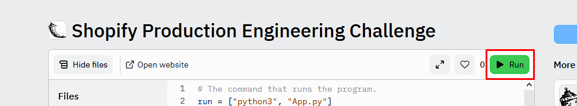
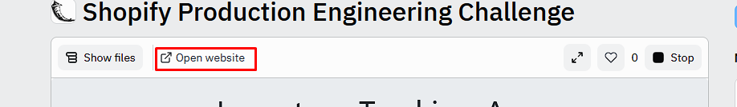

# Inventory Tracking App 📈

This is a simple app to track the inventory of a logistics company. Along with the specifies requirements, this app additionally has the ability to create “shipments” and assign inventory to the shipment, and adjust the inventory quantity appropriately.

## Deployed Demo

The [deployed demo](https://replit.com/@siddhantsin/Shopify-Production-Engineering-Challenge#main.py) of the project is a public replit repository. To run the app, follow the following steps:

**Step 1**: Go to the [project replit page](https://replit.com/@siddhantsin/Shopify-Production-Engineering-Challenge#main.py).

**Step 2**: Click on the green `Run` button under the replit name.

**Step 3**: Click on the green `Open Website` button under the replit name. This will open the app in a new window. Note that for the app to work properly, this step needs to be finished. The browser view that replit provides by default is quite buggy unfortunately.

